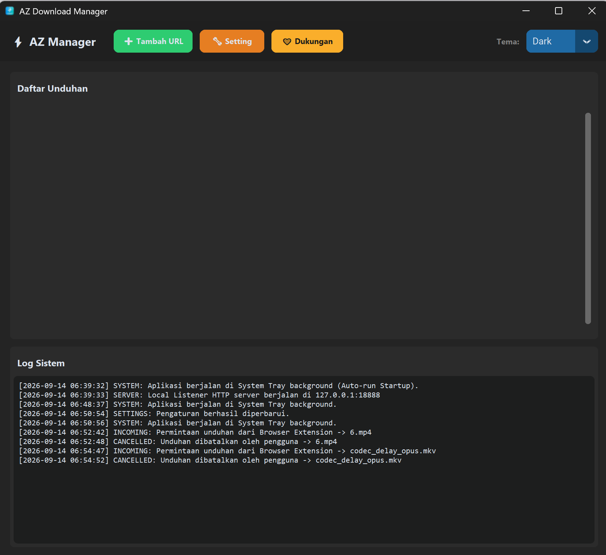
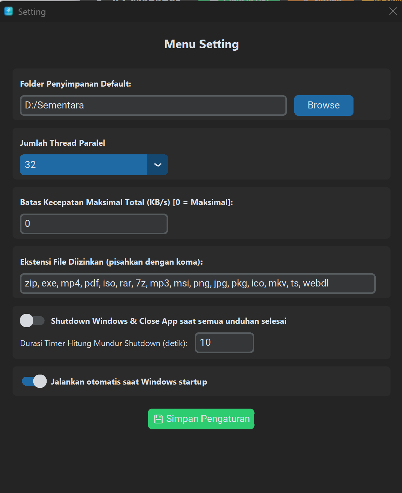
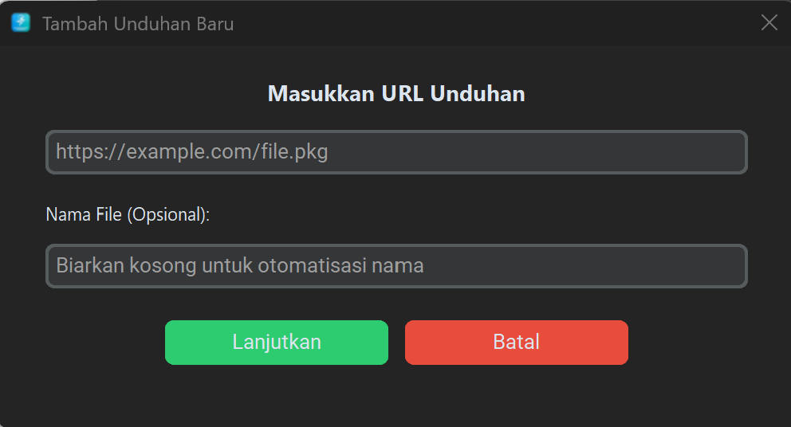

# AZDownloadManager
# ⚡ AZ Download Manager

A modern, fast, and feature-rich multi-threaded download manager built in Python using **CustomTkinter**, complete with a local HTTP server for browser integration, system tray support, and system automation features.

---

## 🚀 Key Features

* **Multi-Threaded Downloading:** Splits files into multiple parallel connections (up to 32 threads) to maximize download speeds.
* **Smart Pause & Resume:** Safely pause, resume, or stop active downloads at any time.
* **Bandwidth Control:** Set global download speed limits to prevent bandwidth monopolization[cite: 1].
* **Browser Integration Ready:** Runs a built-in local background server (`127.0.0.1:18888`) to capture download requests automatically[cite: 1].
* **System Automation:** Option to automatically **shutdown Windows** and close the application after all queue items are successfully downloaded[cite: 1].
* **Sleep Prevention:** Automatically prevents Windows from entering sleep mode while active downloads are running[cite: 1].
* **Persistent History & Config:** Saves download history and configurations safely inside `AppData\Roaming` to bypass permission restrictions[cite: 1].
* **System Tray Minimization:** Closes cleanly into the Windows system tray to run quietly in the background[cite: 1].
* **Modern UI:** Clean user interface powered by `CustomTkinter` supporting System, Dark, and Light themes[cite: 1].

---

## 📋 How to Use

### 1. Launching the Application
* Run the executable (`.exe`) file[cite: 1]. 
* The user interface will appear with a top navigation bar and live system logs[cite: 1].

### 2. Customizing Settings (`🔧 Setting`)
Click the **Setting** button to configure your preferences:
* **Default Directory:** Choose where your completed files will be saved[cite: 1].
* **Parallel Threads:** Select connection density (8, 16, 24, or 32 threads)[cite: 1].
* **Speed Limits:** Set a maximum speed cap in KB/s (or `0` for unlimited)[cite: 1].
* **Allowed Extensions:** Define which file formats are permitted (e.g., `zip, exe, mp4, pdf, iso`)[cite: 1].
* **Auto Shutdown:** Enable automated PC shutdown once your download queue finishes[cite: 1].

### 3. Adding and Managing Downloads
* Click **➕ Tambah URL**, paste your direct download link, and optionally enter a custom file name[cite: 1].
* Monitor real-time progress bars, speed metrics, thread allocation, and Estimated Time of Arrival (ETA)[cite: 1].
* Once completed, use **📑 Buka File** to open the file directly or **📁 Buka Folder** to reveal its destination in Windows Explorer[cite: 1].

---

## 🛠️ Tech Stack

* **Language:** Python[cite: 1]
* **GUI Framework:** CustomTkinter[cite: 1]
* **Networking:** Requests, HTTP Server[cite: 1]
* **System Integration:** Pystray, Winreg, Ctpes[cite: 1]

---

## 🧩 Google Chrome Extension Installation 
For the Google Chrome extension, you need to install it manually because it is not yet available on the web store. 

Here is how to do it:

### **How to Manually Install the Chrome Extension**

1. **Prepare the Extension Folder**
   * Ensure you have a folder containing the extension's source files (such as `manifest.json`, background scripts, and popup files) configured to connect to the app's local server at `127.0.0.1:18888`.

2. **Open the Chrome Extensions Page**
   * Open **Google Chrome** on your computer.
   * Type `chrome://extensions/` into the address bar and press **Enter**.

3. **Enable Developer Mode**
   * In the top-right corner of the Extensions page, toggle the switch to turn on **Developer mode**.

4. **Load the Unpacked Extension**
   * In the top-left corner, click the **Load unpacked** button.
   * Browse to and select the folder where you saved your extension source files, then click **Select Folder**.

5. **Done**
   * The **AZ Download Manager** extension will now appear in your extension list and is ready to automatically capture download links.

##  Screenshot

